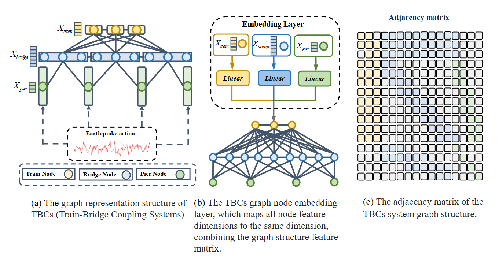

# Patch-based Channel-wise Graph Attention Network (PCGAN)

## Abstract

Predicting the long-term response of complex structural systems, such as train-bridge coupled systems (TBC), under seismic conditions presents significant challenges due to high computational complexity and time constraints. Traditional deep learning models have several limitations, such as poor generalization, difficulty adapting to different structural forms, and an inability to effectively model uncertainty. To address these challenges, we propose an innovative model—**Patch-based Channel-wise Graph Attention Network (PCGAN)**. This model represents complex structures as graphs, encoding each node and utilizing a masked attention mechanism between nodes to extract spatial topological information. At the same time, it employs a patch-based channel-wise attention mechanism to capture temporal patterns, achieving more accurate and efficient modeling of temporal information. By introducing latent states and adjusting the weighting between Kullback-Leibler (KL) divergence constraints and prediction accuracy constraints, the model can output a random range rather than a single absolute result, thereby enhancing the flexibility and reliability of the predictions.




## Introduction

Traditional seismic response analysis typically relies on physical equations and numerical simulations. While these methods are accurate, they are computationally expensive, especially for complex structures, as the required computation time and resources can be enormous. In contrast, **machine learning techniques** can automatically extract patterns from historical data by training models, enabling real-time, low-cost risk assessment and decision support in practical engineering applications. 

Similarly, in the study of train-bridge coupled systems, the finite element method (FEM) and time-history analysis are commonly used to simulate the dynamic response of trains under different loads. However, FEM typically faces the issue of low computational efficiency, making it challenging to achieve fast computations in complex scenarios. Deep learning methods have emerged, offering a more efficient alternative, providing significant advantages in long-term prediction and complex condition management, much like the benefits machine learning offers in seismic response prediction.

For the complex response structure of the train-bridge coupled system, accurately modeling the coupling relationships between components is crucial. Therefore, it is particularly necessary to introduce **graph structures** to model the train-bridge coupled system. Various models, such as **GN Block** and **adaptive models based on graph neural networks (GNNs)**, have been proposed to improve adaptability and inference capabilities. In contrast, time series models like AutoFormer, TimesNet, and TCN typically ignore the spatial topology and only consider the time-series state of nodes, making GNN-based models more effective for structural response prediction.

Several GNN-based models, such as **Spatio-Temporal Graph Convolutional Networks (STGCN)** and **Graph WaveNet**, have achieved significant success in time series forecasting tasks. These models leverage graph structures and time data to capture complex dependencies between nodes in graph-structured time series, enabling accurate long-term forecasting. However, they still have some limitations, including insufficient generalization across different structures and unnecessary computations for nodes that do not require prediction.

Additionally, engineering practice involves uncertain factors like seismic wave randomness and material parameter discreteness, which make the actual response of the structure probabilistic rather than deterministic. Our model aims to provide prediction results with reasonable randomness, giving confidence intervals and enhancing the prediction's flexibility.

To precisely model complex coupling relationships between various components, we adopt a **masked graph attention mechanism**, which dynamically adjusts feature vectors for each node. This mechanism ensures that nodes focus only on neighboring nodes, preserving the integrity of the graph structure. 

In terms of target processing, we propose a strategy that separates spatial and temporal extraction. First, the graph attention mechanism captures spatial information, and then temporal processing focuses only on the target node. This reduces unnecessary computation and ensures efficiency. We also use a **patch-based segmentation method**, which significantly reduces complexity and improves handling of long time-series data.

To further optimize temporal processing, we introduce a **channel attention mechanism** combined with the patch-based approach, strengthening temporal features and improving long-term dependency modeling. A **causal convolution module** performs lightweight extraction, ensuring the model only processes the nodes that require predictions, significantly reducing computational load.

## Features

- **Graph-based modeling** for train-bridge coupled systems
- **Patch-based temporal attention mechanism** for efficient processing
- **Masked attention mechanism** to preserve spatial topological structure
- **Uncertainty modeling** using Kullback-Leibler (KL) divergence
- **Residual attention module** to mitigate vanishing gradient problem
- **Optimized computation** by focusing on relevant nodes for prediction

## Installation

To install the required dependencies, run:

```bash
pip install -r requirements.txt
